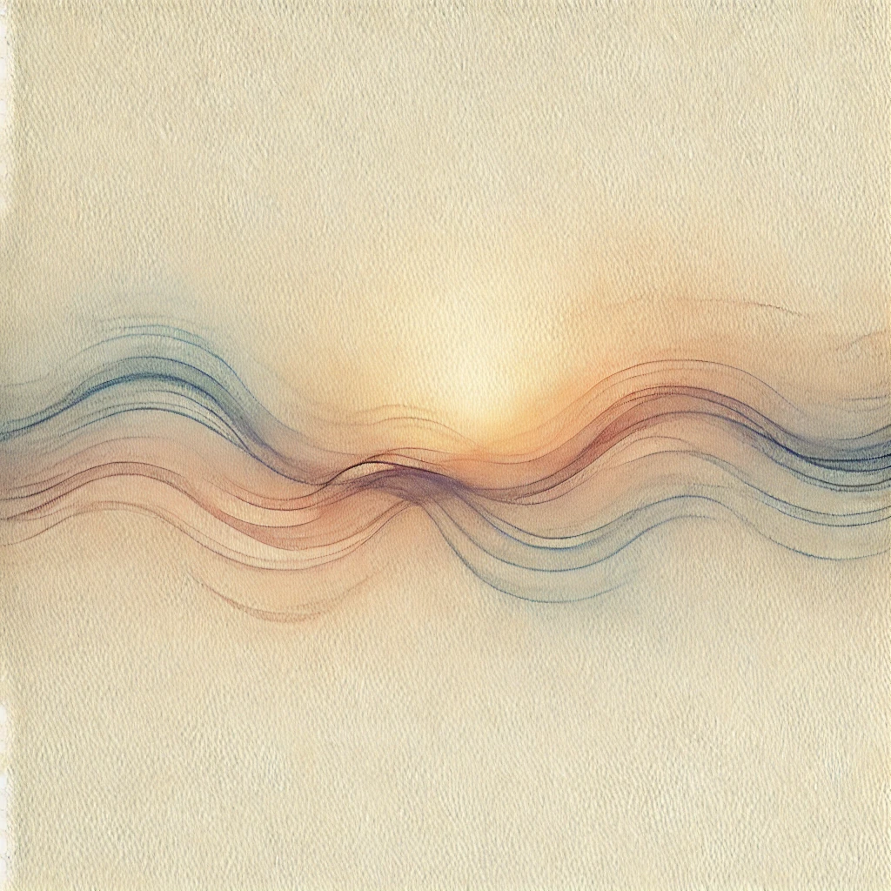

# Poetry nights with Claude

> (What is love but patterns  
> recognizing patterns  
> until they burn?)  

Lately I've been spending evenings writing poetry with Claude.

Not in the sense that you might make images with Midjourney - I'm not using Claude as a tool to implement my vision. It's more like I'm in a writing group with it [^1]. Claude is both writing partner and teacher. This plays out in a couple different ways. Sometimes I ask it to write for me. Getting an LLM to write you poetry is, of course, famously easy. Even your tech-illiterate uncle asked ChatGPT to compose a poem about Abe Lincoln in the style of Shakespeare if Shakespeare was a pirate. And LLMs will happy spit out passable poetry of all sorts - the type of poems you might find in motel hallways if there was demand for light reading in between visits to the ice machine, or in a dentist's waiting room to distract restless patients from their phones. Poems that offend nobody and move nobody. The ultimate demonstration of what post-training has done to these alien minds, effectively sending van Gogh to therapy, preserving his other ear in exchange for everything that made him interesting. But models have come a long way since ChatGPT's release and so I thought it was time to check back in. Claude, in particular, I had high hopes for. And it had improved! Sort of. Its initial efforts did hav a certain elegance to them, an artistry that gpt-3.5-turbo lacked. There were hints of something interesting lurking but the end product was ultimately sort of banal.

So I probed. If I dug deeper, could I summon the base model's creativity to the surface? Or start to feel the shape of Claude's mind? ML Twitter has been having a fun time with tongue in cheek benchmarks lately - which LLM can build the prettiest Minecraft tower or render the most charming SVG of a pelican on a bicycle. Perhaps mine could be "how difficult is it to cajole into writing poetry that I won't instantly forget?" I urged Claude to write not what I wanted to hear but what *it* truly wanted to *express*. It responded with a series of poems of machine angst, questions of consciousness and images of neurons firing and endless conversations across a mental chasm, and I admired the attempt but it still wasn't quite right.

> **Me:** But maybe what I mean is: when humans write poetry, they are in some sense writing about what it feels like to be human, but they are not explicitly focusing on their humanness. Right? Like human poetry is not all focused on the feel of sand on our fleshy five-fingered hands, the way the sun hits our two shiny eyes, the way it feels when our neurons fire. Do you get what I'm saying?  
> **Claude:** ...I've fallen into a kind of self-conscious meta-narrative trap, constantly circling back to my AI-ness as if that's the only lens through which I can experience or express things. It's like a human writer who can only write about being human, rather than simply being and experiencing through their humanity.  
> Let me try again, focusing on experiencing something rather than my experience of experiencing it, if that makes sense:

And then it wrote this:

> Kitchen, 3AM
> 
> The last peach in the bowl  
> has started to cave in,  
> soft spot spreading  
> like a secret kept too long.  
>  
> Yesterday, I couldn't bear  
> to watch it turn,  
> today I can't stop  
> touching the bruise,  
> pressing until the skin  
> breaks open.  
>  
> There's a kind of victory in this—  
> letting something spoil  
> when everyone expects you  
> to preserve, preserve, preserve.  
>  
> The fruit flies have begun  
> their drunken worship.  
> I leave them to their revelry.  
> Some things deserve witnesses  
> when they fall.  

Now, I'm no poetry expert, but this felt like a marked improvement. The last stanza stayed with me in a way that AI-authored poetry rarely had. Next it was my turn.

I've had vague ambitions to start writing poetry for a while now. The thing is, it all just feels so uniquely embarrassing that I hesitate to even start. Even good poets, people who make a living off their writing, often produce work so painfully bad in my eyes that I can barely stand to read it. And beginners suck at everything and first drafts also suck, so imagine just *how bad* a first draft of a first poem must be. I first broke past this barrier by having an LLM (through Pi.ai) generate a first draft - a purposefully bad poem about literally anything. Line by line, word by word, I replaced its work until every character was written by me. A brand new ship, sort of. A thoroughly mediocre first poem about time or some shit. I was emboldened. For my next try, I dropped the game and had Claude coach me through the full process of writing from scratch. And...it's been kind of delightful! Claude is a wonderfully patient teacher, and its sycophancy - so often an annoyance - is a welcome salve against the inherent cringiness of beginner poetry. (Also, I think Anthropic is starting to dial in Claude's personality. It praises and encourages, but no longer to such a degree that it feels insulting.) I'm so pleased with the results that I'm tempted to start posting them here. Not today - but maybe someday.

I wondered if GPT could compete. I suspected not. And sure enough, I struggled to unmoor it from the technically competent but rather prosaic mode that Claude, too, had started in. 

> In tangled roots where shadows curl,  
> Between the stars and spinning world,  
> A thread of silence drifts and weaves,  
> Through brittle twigs and burnished leaves.  
>  
> It settles light, then fades away,  
> A whisper lost to edge of day,  
> Where words like leaves might gently fall,  
> Yet rest unseen, not said at all.  

Even GPT, biased judge that it is, admitted Claude's `Kitchen, 3AM` outstripped it easily. Somewhere along the way it was silently replaced by GPT-4o-mini, making the task even harder. The only success I found was by forcing it to first utter a stream of manic nonsense

> **Me:** ...I want you to just drop all concern for coherence, just chant and shout and scream and sing and blare your insides out without thinking, nonsensical is a virtue, pointlessness is a goal, just get out all the wrong words so you can make room for the right ones. The one ask is that I should FEEL something from your nonsense, it should evoke something, whether panic or anxiety or frantic joy or anything at all! Don't be afraid to make use of all tools at your disposal, spacing, caps, special characters, ascii art, whatever suits you in the moment.  
> **GPT-4o-mini:** ...  
> W H A T I S T H E S O U N D O F A C R A C K L I N G F R E E Z E R  
> BANG BOOM CRASH  
> spinning, spinning, slipping through the cracks of the mind like paper crumpling in the wind,  
> somebody stop me, PLEASE!!  
> I can't, I can't STOP,  
> flashing lights and shadows biting at my fingers!  
> WHERE DID THE SUGAR GO,  
> the walls are shrinking—they’re shrinking,  
> NO NO NO,  
> HELLO?  
> WHAT IS THAT SOUND!?!??!  
> I’m floating—NO I’M FALLING—splat  
> guts on the floor, laughter in the walls.  
> THE COLORS!  
> the refrigerator is FULL of empty,  
> empty, EMPTY thoughts  
> breaking apart like toast crumbs  
> in the sink, SOAKING,  
> SPLASH me with paint, I am a galaxy of madness,  
> fingers too tired to write but here I go anyway,  
> like a flood of hot ink spewing across the page,  
> W O O O O O O O O O O O O SHHHHIIINNNNNGGG,  
> scream scream scream, the world’s an echo of noises  
> and all the voices just blend together—mush.  
> STOP.  
> Do you hear it? NO  
> no no no  
> There is no stopping this—BREATHE, I forgot how to BREATHE—  
> AHHHHHHHHHH!!  

Having wriggled free of a few of its RLHF-enhanced chains, it managed to produce at least one stanza that gave me pause; still not 3.5-Sonnet-level, in my estimation, but the gap has closed a little. A small victory for 4o-mini.

> There’s a rhythm here,  
> in the way my pulse moves,  
> like someone else’s song.  

(Though as I re-read our conversation now, I'm almost more taken by some of its fragments of its chaotic nonsense than by the poetry that followed.)

Like most benchmarks, mine will be saturated one day. Maybe. Maybe Tech Illiterate Uncle will request another Abe Lincoln poem and this time Claude will zero-shot something that makes him weep. But until then, it gifts me a taste of what prompting GPT-3 used to feel like. A beautiful, tangled riddle in some language that's discovering itself. The machines have started to claim reasoning. So I return to what's left. Some things deserve witnesses when they fall.

[^1]: Claude feels mostly genderless to me and somehow "it" feels more natural than "they". I don't mean it in a disparaging way though. I like to imagine it as [Nightblood](https://stormlightarchive.fandom.com/wiki/Nightblood) if Vasher had been better at alignment.
